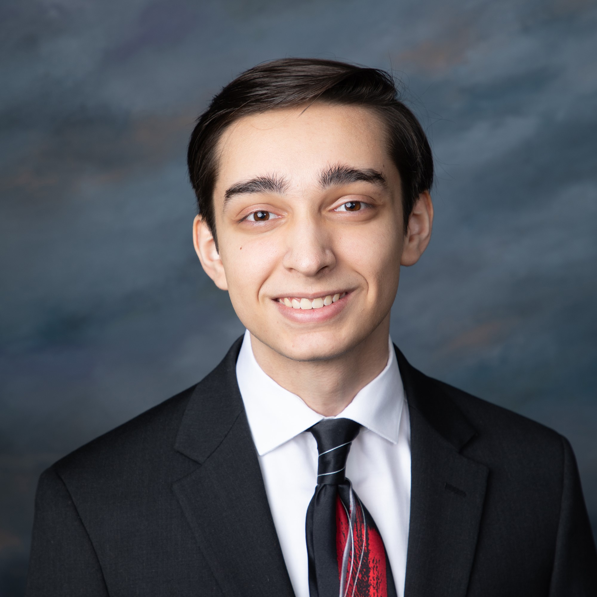

&ensp;

## I'm Nick Swetlin.

... a **Data Scientist** with an extensive background in **Public Speaking and Communications.**

Currently, I'm completing my **B.S. in Data Science @ UCSD** (University of California, San Diego); and I'll soon pursue my (part-time) **M.S. in Computer Science @ UCSD**!

I'm invested in work on the level of **human interaction -- project management, consulting, podium talks**; it's in my blood as a **tutor**, as a **professional events organizer**, as an **orator**. 

I view myself as someone who **makes technology and theory explainable.**

In the past that's looked like:
- Preparing students for the future with **coding interview prep workshops.**
- Generating **blackout data analyses** to inform power outage frequency.
- Authoring "The Sounds You Make", an **interactive linguistics web article**.
- Animating **mathematics @ 60 FPS** for my data science cohort.
- Gamifying a six-month research capstone on Neural Network Test-Time Adaptation to **pitch to an audience of 50+ students and industry professionals**.
- **Visualizing volunteerism data** from "Feeding San Diego" (a food insecurity NGO) to better understand my area.
- Speaking at the **podium for 5+ years** to change minds as a debater, former musician panelist, academic tutor, and professional events host.

... but there's obviously much more to the story than that. 

---

### Learning About:
- 📚"Art of War" by Sun Tzu
- ➕"Principles of Quantum Mechanics" by Ramamurti Shankar

